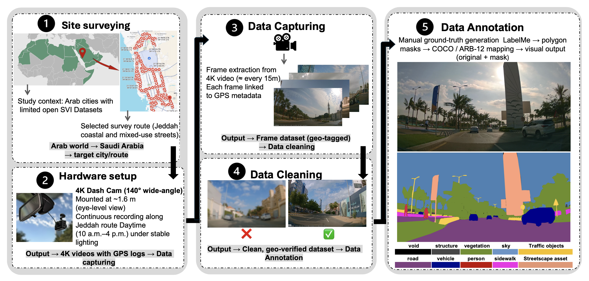
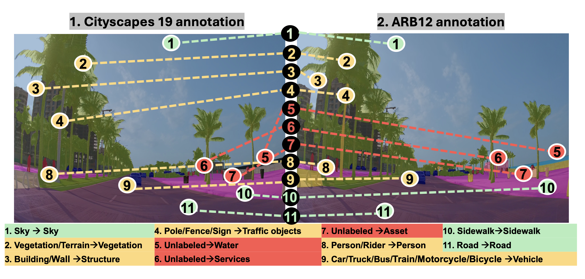
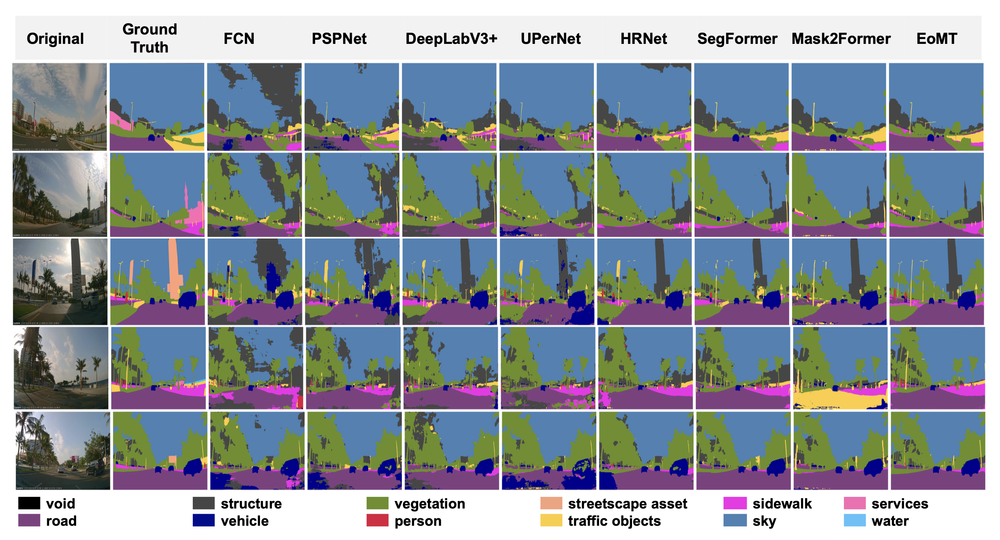

# ARB12: Addressing Geographic and Semantic Bias in Urban Street-View Segmentation for Arab Cities

Official implementation of the paper:
"ARB12: Addressing Geographic and Semantic Bias in Urban Street-View Segmentation for Arab Cities"

**Authors:**
- [Mrs. Dalia Alharbi, University of Strathclyde](https://pureportal.strath.ac.uk/en/persons/dalia-salman-b-alharbi/)
- [Dr. Mohamed Elawady, University of Strathclyde](https://pureportal.strath.ac.uk/en/persons/mohamed-elawady/)

**Conference:** 14th European Conference on Visual Information Processing, 28th September-1st October 2026, Luxembourg (EUVIP 2026)

## Overview
> Annotation Pipeline of ARB dataset

> Taxonomy Mapping from Cityscapes-19 to ARB12

> Qualitative Results
