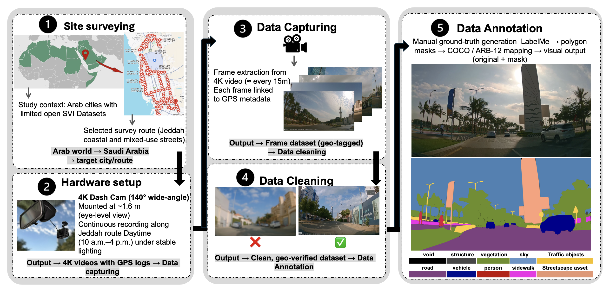
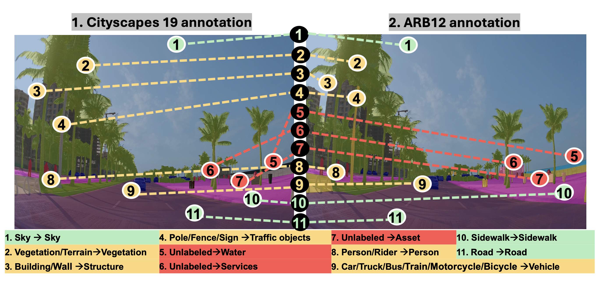
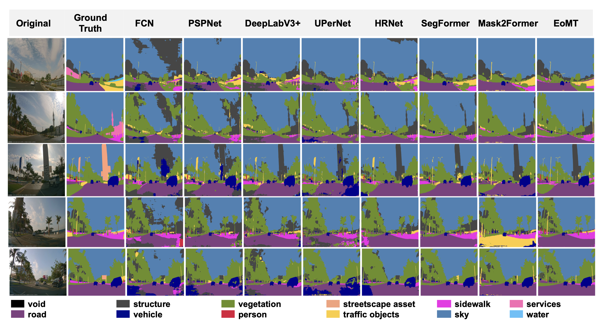

# ARB12: Addressing Geographic and Semantic Bias in Urban Street-View Segmentation for Arab Cities

Official implementation of the paper:
"ARB12: Addressing Geographic and Semantic Bias in Urban Street-View Segmentation for Arab Cities"

**Authors:**
- [Mrs. Dalia Alharbi, University of Strathclyde](https://pureportal.strath.ac.uk/en/persons/dalia-salman-b-alharbi/)
- [Dr. Mohamed Elawady, University of Strathclyde](https://pureportal.strath.ac.uk/en/persons/mohamed-elawady/)

**Conference:** 14th European Conference on Visual Information Processing, 28th September-1st October 2026, Luxembourg (EUVIP 2026)

## Overview

ARB12 addresses geographic and semantic biases in urban street-view semantic segmentation, with a particular focus on **Arab cities**.

The project introduces an annotation and taxonomy-mapping pipeline designed to improve the representation of urban scenes from Arab cities and facilitate their use with established semantic-segmentation frameworks.

The repository contains the resources associated with the ARB12 dataset and the experiments presented in the paper.

### Annotation Pipeline

The following figure illustrates the annotation pipeline used to construct the ARB dataset.

### Taxonomy Mapping

ARB12 provides a mapping from the **Cityscapes-19** taxonomy to the proposed **ARB12** label space.

### Qualitative Results

Examples of qualitative segmentation results are shown below.

## Source Code

The **source code for the ARB12 experiments and implementation will be released shortly**.

> 🚧 **Code release:** The repository is currently being prepared for the public release of the source code, execution configurations, and supporting resources.

## Dataset

Further details about the ARB dataset, including its annotation protocol, taxonomy, and data availability, will be provided with the code and dataset release.
